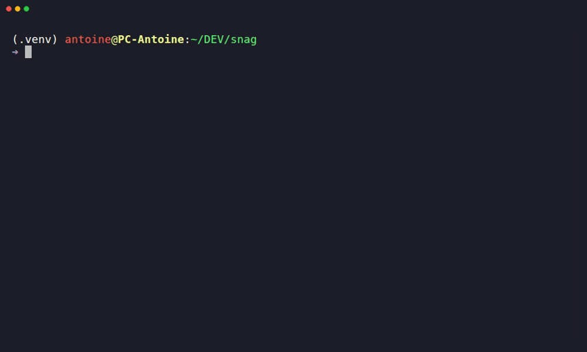

# Snag

A lightweight CLI media downloader based on `yt-dlp`.

<p align="center">
  
</p>

## Installation

### Linux / macOS
Run this single command in your terminal to download the latest binary, move it to your local system path, and grant execution permissions:

```bash
sudo curl -L "[https://github.com/Amnyzix/snag/releases/latest/download/snag](https://github.com/Amnyzix/snag/releases/latest/download/snag)" -o /usr/local/bin/snag && sudo chmod +x /usr/local/bin/snag
```

### Windows
1. Download `snag.exe` from the [Latest Releases](https://github.com/Amnyzix/snag/releases/latest).
2. Move it to a folder of your choice (e.g., `C:\Tools`).
3. Add that folder to your User/System **Environment Variables (PATH)** to run the command from any terminal session.

> **Note on First Launch:** On its very first execution, `snag` will automatically download and provision its standalone extraction engines (`yt-dlp`, `deno`, and `ffmpeg`) inside an isolated user directory (`~/.snag/bin`). This happens completely transparently and only occurs once.

## Usage

Simply type `snag` in your terminal window and follow the interactive prompts:

```bash
snag
```

1. **Paste the media URL:** Supports YouTube, Instagram Reels, TikTok, and more.
2. **Select the format:** Choose between high-fidelity Video (MP4) or standalone Audio (MP3).
3. **Select the quality:** Choose High, Medium, or Low to automatically balance resolution, bitrate, and file size.

### Updating Engines
When platforms update their anti-bot protections or algorithms, you do not need to reinstall `snag`. Simply update the internal extraction engines directly from your terminal:

```bash
snag --update
```

## Architecture & Development

The codebase is split cleanly to ensure maintainability:

- `src/main.py`: Interactive user interface, state handling, and runtime execution loop.
- `src/options.py`: Automated routing engine transforming human choices into CLI arguments for `yt-dlp`.
- `src/installation.py`: Cross-platform binary dependency manager, handling standalone engine provisioning and self-updates (`--update`) while avoiding system file locks.

### Local Compilation
To compile the standalone binaries manually on your machine, install PyInstaller inside your virtual environment and execute:

```bash
pip install pyinstaller rich questionary
pyinstaller --onefile --name snag src/main.py
```

## Continuous Integration (CI/CD)

This repository contains an automated multi-stage GitHub Actions pipeline (`.github/workflows/build.yml`). Every time you push a version tag (`v*`), isolated Windows and Ubuntu runners spin up in parallel to compile native system binaries and automatically attach them to a fresh GitHub Release.

## License

This project is open-source and available under the [MIT License](LICENSE).